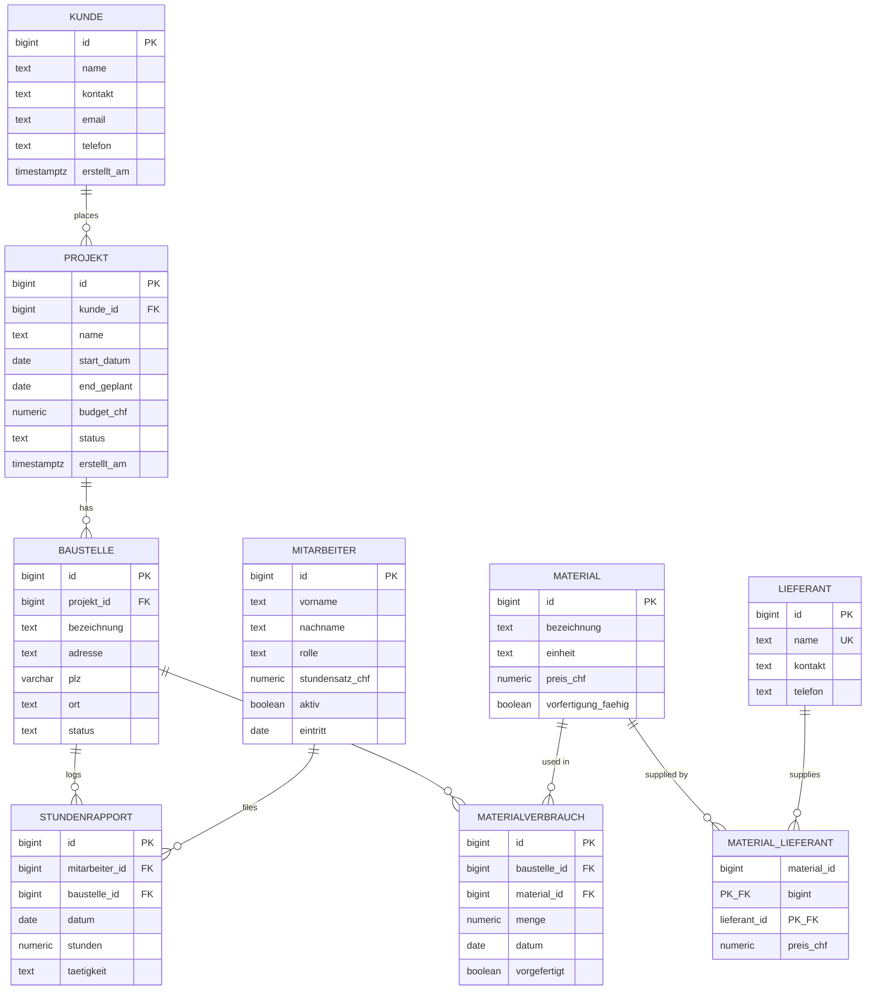

# Construction Project Tracker

A PostgreSQL-based cockpit for electrical construction projects. Centralizes
hours, material consumption, and budget data per construction site, and
will expose live KPIs (budget usage, prefab share, worker utilization) through
SQL views that power a dashboard for project leaders.

Built as a portfolio piece to demonstrate database design, query writing,
and the data layer of a small full-stack application.

## What it does

A typical electrical contractor manages dozens of construction sites across
many projects, with workers logging hours daily and material being consumed
on each site. Today most of this lives in Excel files or paper rapports.
This project models that domain in a normalized PostgreSQL schema and
will aggregate the raw rows into dashboard-ready KPIs.

The dashboard will answer questions a project leader actually asks:

- Which projects are over budget right now?
- Which sites have the highest prefab adoption?
- How is each worker's time distributed across sites?
- Where is material spending concentrated?

## Tech stack

- **Database:** PostgreSQL 17
- **Schema:** 9 normalized tables, foreign keys with intentional cascade rules,
  CHECK constraints replacing ENUMs
- **Seed data:** ~900 rows of realistic Swiss/Aargau-flavored test data,
  generated partly via `generate_series` for hours and material entries
- **Reporting layer:** SQL views (planned) — CTEs, conditional aggregation
  (`FILTER`), and safe division (`NULLIF`)
- **Dashboard:** Next.js (planned)
- **Containerization:** Docker Compose (planned)

## Schema



### Cardinality notation

- `||` = "exactly one"
- `o{` = "zero or more"

So `KUNDE ||--o{ PROJEKT` reads as: one customer has zero or more projects;
each project belongs to exactly one customer.

### Key design notes

- **MITARBEITER ↔ PROJEKT have no direct relationship.** A worker's involvement
  with a project is derived through the hours they log on its Baustellen
  (`stundenrapport → baustelle → projekt`). This matches how the domain
  actually works: workers flow between sites day to day rather than being
  formally assigned to projects.

- **ON DELETE behavior is intentional:** `PROJEKT → BAUSTELLE` cascades (delete
  a project, all its sites go too), but `KUNDE → PROJEKT` restricts (you can't
  delete a customer who still has projects).

- **`MATERIAL_LIEFERANT` is a pure junction table** (composite PK of both FKs),
  modeling the many-to-many supplier relationship with per-supplier pricing.

The three core relationships:

1. `KUNDE → PROJEKT → BAUSTELLE` — customers commission projects, projects
   contain construction sites
2. `MITARBEITER ↔ BAUSTELLE` via `STUNDENRAPPORT` — workers log hours on sites
3. `MATERIAL ↔ BAUSTELLE` via `MATERIALVERBRAUCH` — material is consumed on sites,
   with a `vorgefertigt` flag tracking prefab-vs-onsite assembly

## Repository structure

```
construction-project-tracker/
├── README.md
├── db/
│   └── migrations/
│       ├── 001_create_db.sql
│       ├── 002_create_kunde.sql
│       ├── ...
│       └── 011_create_seed_data.sql
└── .gitignore
```

Migration files are numbered by execution order and idempotent (each
includes `DROP TABLE IF EXISTS ... CASCADE` at the top), so the whole
database rebuilds cleanly from scratch.

## Running locally

Requires PostgreSQL 17 running on `localhost:5432`.

```bash
# Create the database
psql -c "CREATE DATABASE construction_project_tracker;"

# Run migrations in order
for f in db/migrations/*.sql; do
  psql construction_project_tracker -f "$f"
done
```

A Docker Compose setup is planned that will rebuild the entire schema and
seed data on `docker compose up` via `docker-entrypoint-initdb.d`.

## Status

- [x] Schema and FK design
- [x] Seed data (Aargau-realistic, ~900 rows)
- [ ] Reporting views
- [ ] Next.js dashboard
- [ ] Docker Compose for one-command setup

## License

MIT
