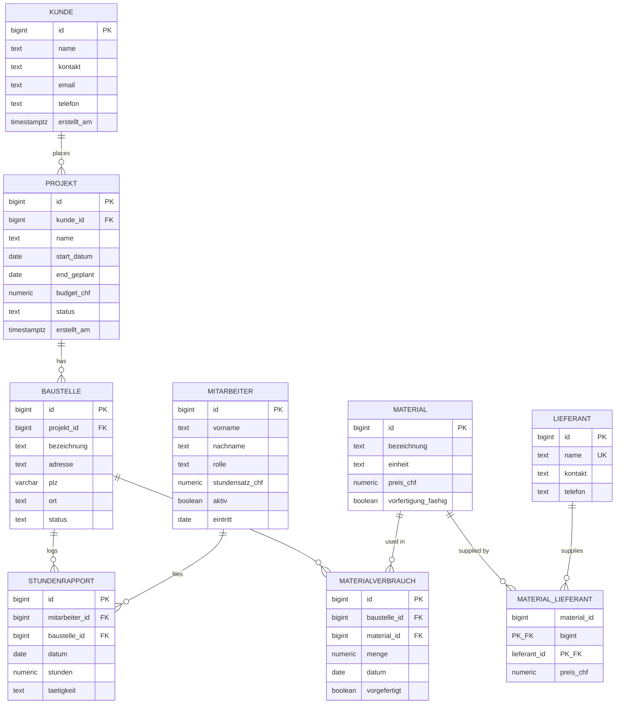

# ER Diagram — Construction Project Tracker

This diagram shows the database schema for the Baustellen-Cockpit:
9 tables modeling projects, construction sites, workers, materials, and the
relationships between them.

## Cardinality notation

- `||` = "exactly one"
- `o{` = "zero or more"

So `KUNDE ||--o{ PROJEKT` reads as: one customer has zero or more projects;
each project belongs to exactly one customer.

## Key design notes

- **MITARBEITER ↔ PROJEKT have no direct relationship.** A worker's involvement
  with a project is derived through the hours they log on its Baustellen
  (`stundenrapport → baustelle → projekt`) Workers flow between sites day to day rather than being formally
  assigned.

- **ON DELETE behavior is intentional:** `PROJEKT → BAUSTELLE` cascades (delete
  a project, all its sites go too), but `KUNDE → PROJEKT` restricts (you can't
  delete a customer who still has projects).

- **`MATERIAL_LIEFERANT` is a pure junction table** (composite PK of both FKs),
  modeling the many-to-many supplier relationship with per-supplier pricing.
